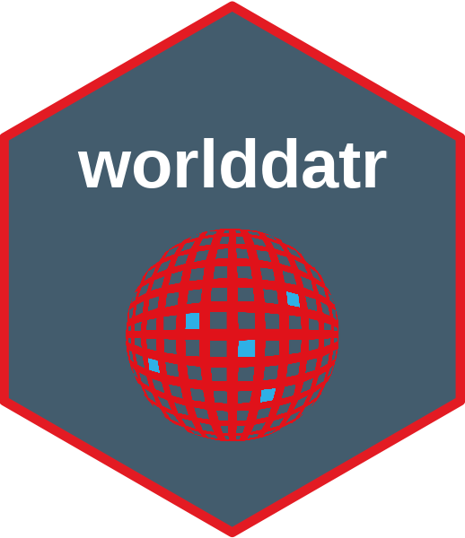

# worlddatr

<!-- badges: start -->



[](https://lifecycle.r-lib.org/articles/stages.html#stable) 
[](https://CRAN.R-project.org/package=iddoverse) 
[](https://github.com/taxonomicallyinformedannotation/tima/actions/workflows/R-CMD-check.yaml) 
[](https://hits.seeyoufarm.com)

<!-- badges: end -->

Country and Territory data including ISO codes, World Bank income groups, longitude and latitude. These can be used to plot choropleth maps and other spatial statistical analysis.

Creating maps to showcase the global distribution of studies or participants is a powerful way to visualise data, however, extracting the necessary information and data cleaning can often be time-consuming and burdensome. Some datasets use 3 digit ISO codes, while others use 2 digit or the just the name of the country. Country name is often problematic as they are not standardised, for instance, North Korea can be recorded as N. Korea or Democratic People's Republic of Korea, likewise Spain and España. Accents and other special characters which are not machine readable also prevent smooth merging of data. Some data sources may group territories, such as Jersey & Guernsey represented as simply 'Channel Islands'.

Key features of worlddatr include:

-   Pre-processed Datasets: Access to pre-cleaned datasets that are ready to merge with your data, reducing the time spent on data preparation.
-   One-command Utilty: Functions that allow you to produce maps with a single command, while still providing control over customisation options such as colours, titles, and legends.
-   Open Source and Community-driven: Being open-source, worlddatr invites users to build upon its code, tailor visualisations to their specific needs, and contribute improvements back to IDDO, enhancing the tool for the entire research community.

By using worlddatr, researchers can efficiently visualise and analyse global data trends, focusing more on their research and less on data manipulation.

## Installation

You can install the `worlddatr` package from [GitHub](https://github.com/Infectious-Diseases-Data-Observatory/worlddatr) with:

``` r
# install.packages("devtools") #if you have not previously installed 'devtools' on your machine
devtools::install_github("Infectious-Diseases-Data-Observatory/worlddatr", dependencies = TRUE, build_vignettes = TRUE)
library(worlddatr)
```

We recommend updating the install when a new version of the package is available. It is best to remove the package and reinstall the current version:

``` r
detach("package:worlddatr", unload = TRUE)

devtools::install_github("Infectious-Diseases-Data-Observatory/worlddatr", dependencies = TRUE, build_vignettes = TRUE)
library(worlddatr)
```

## Using World Data

There are two datasets in the `worlddatr` package:

-   `world_income`

    -   [250 rows x 7 columns]

    -   One row per country or territory, with country/territory name, ISO code ([ISO Online Browsing Platform](https://www.iso.org/obp/ui/#search)), economy name and income group ([World Bank](https://datahelpdesk.worldbank.org/knowledgebase/articles/906519-world-bank-country-and-lending-groups))

-   `world_map`

    -   [99,338 rows x 13 columns]

    -   Contains the information in `world_income` joined with `map_data("world")` from `ggplot2` which has the coordinate information of the perimeter of each region in the world. Combined this allows for income data to be mapped.

``` r
head(world_income)

head(world_map)
```

A vignette demonstrating the package can be found [here.](https://infectious-diseases-data-observatory.github.io/worlddatr/articles/worlddatr.html)

## Citation

To cite `worlddatr`, see [CITATION](https://github.com/Infectious-Diseases-Data-Observatory/worlddatr/blob/main/inst/CITATION)

Data comes from the following sources:

-   World Bank (<https://datahelpdesk.worldbank.org/knowledgebase/articles/906519-world-bank-country-and-lending-groups>)

-   ISO (<https://www.iso.org/obp/ui/#search>)

-   IDDO REDCap

-   world-countries-centroids (<https://github.com/gavinr/world-countries-centroids>)

Thanks to the owners and contributors to these sources and for making them accessible for reuse.

## Issues

Improvements to the code are constantly being made, if you notice errors, bugs, want to suggest improvements or have ideas for better functionality, please describe them in [Issues](https://github.com/Infectious-Diseases-Data-Observatory/worlddatr/issues).

## Contact

Please contact Rhys Peploe ([rhys.peploe\@iddo.org](mailto:rhys.peploe@iddo.org){.email} or [rhyspeploe1998\@gmail.com](mailto:rhyspeploe1998@gmail.com){.email}) if you would like to know more.
