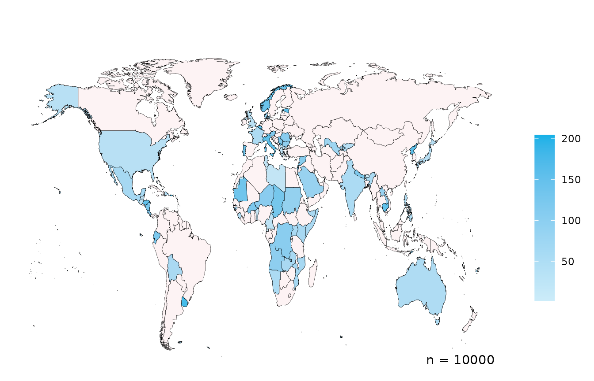
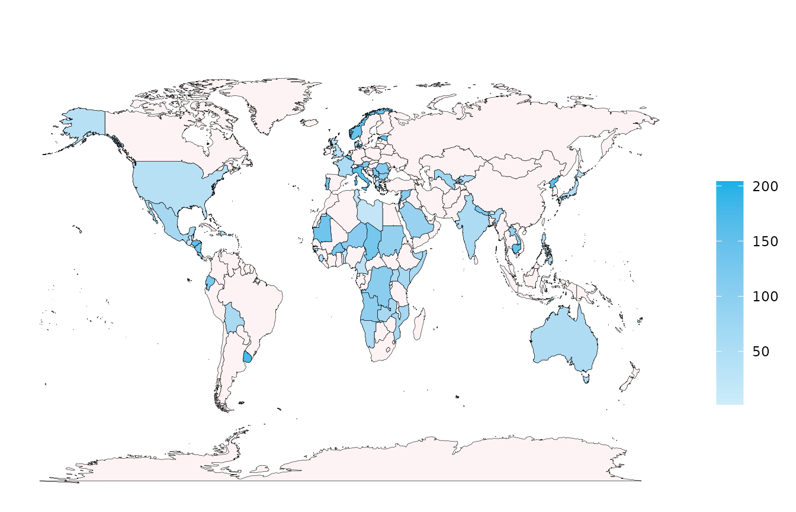
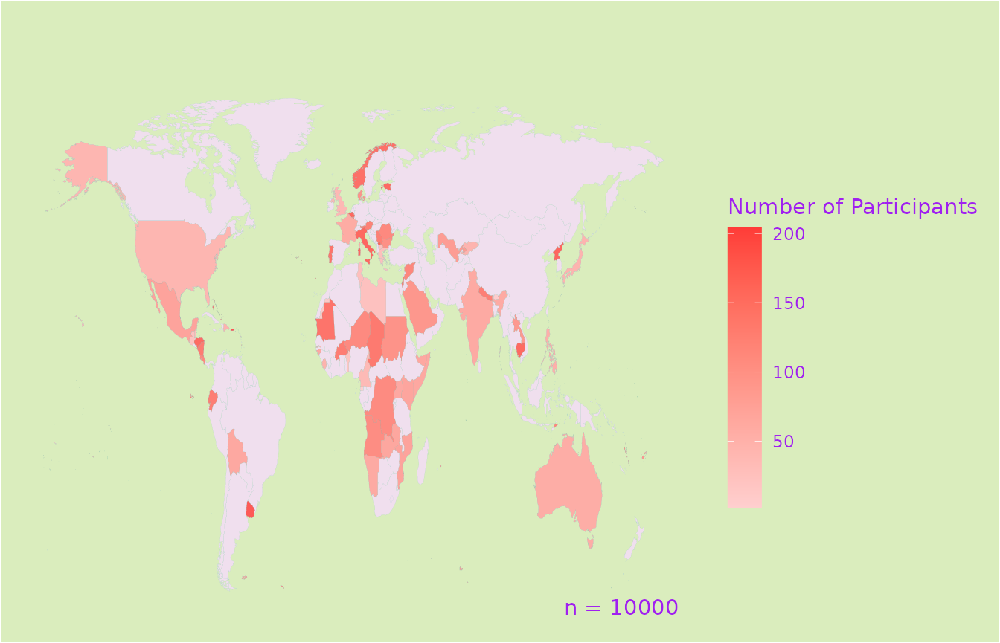
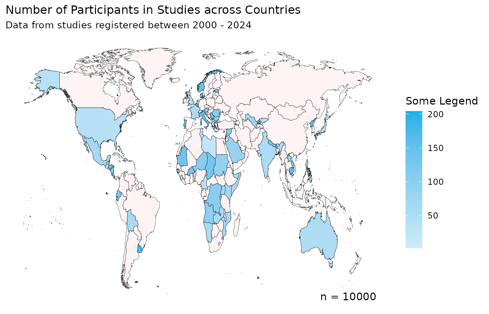
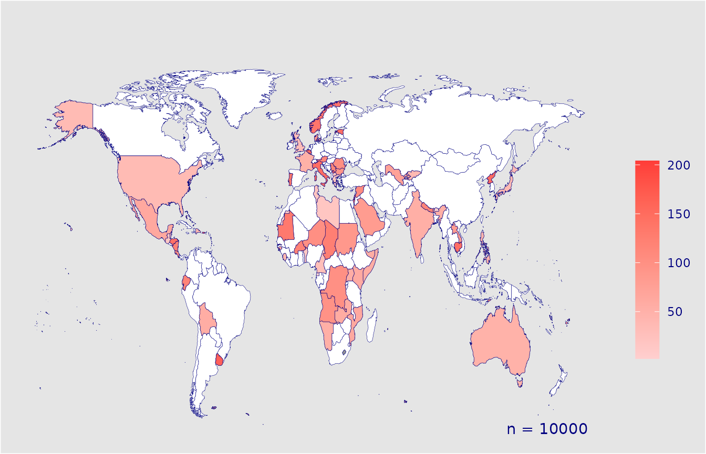
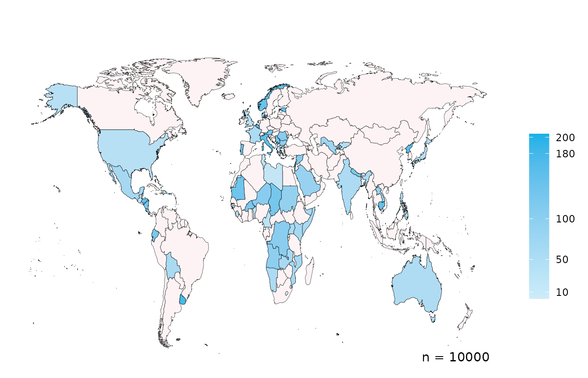
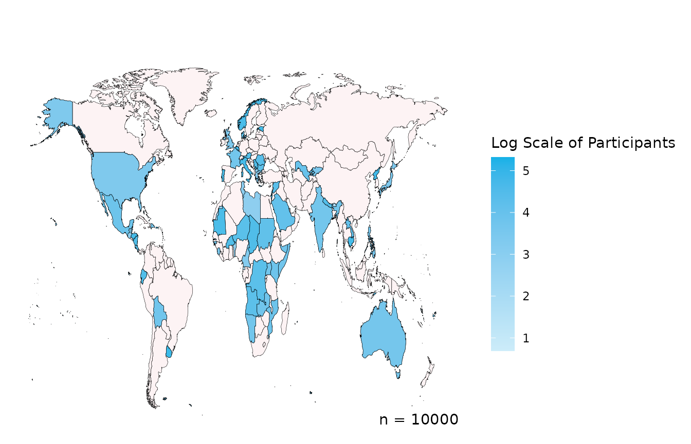

# worlddatr

`worlddatr` makes creating choropleth maps easier and quicker so you can
spend more time of your research instead of data cleaning. Often, you
will want to analyse global trends in data, include metrics such as
income level of the country and plot all of this information on a map of
the world. However, these various data sources use different variables,
country names and codes, consequently, the data is time-consuming and
burdensome to use, especially if you are new to programming langauages
such as R. For instance:

- Various spellings of a country/territory (i.e. North Korea, N.Korea,
  Democratic People’s Republic of Korea)
- English or native translations, non-ASCII Characters (i.e. Spain,
  España)
- Different definitions or groupings of countries/territory
  (i.e. Channel Islands grouped together, or Jersey, Guernsey etc.
  listed separately)

Typically, each researcher wanting to plot the globe would need to go
through this data cleaning process, we’ve done this so you don’t have to
and packaged it into an R package, `worlddatr`. Key features include:

- Pre-processed Datasets: Access to pre-cleaned datasets that are ready
  to merge with your data, reducing the time spent on data preparation.
- One-command Utilty: Functions that allow you to produce maps with a
  single command, while still providing control over customisation
  options such as colours, titles, and legends.
- Open Source and Community-driven: Being open-source, worlddatr invites
  users to build upon its code, tailor visualisations to their specific
  needs, and contribute improvements back to IDDO, enhancing the tool
  for the entire research community.

## Installing worlddatr

You can install the `worlddatr` package from
[GitHub](https://github.com/Infectious-Diseases-Data-Observatory/worlddatr),
there you can find the code required.

## Datasets

There are two datasets in the package, `world_income`, which has a row
per country/territory and provides the country ISO codes, name and
income group. This has 250 rows and 7 columns. `alpha_3_code`,
`alpha_2_code` and `numeric` refer to the ISO standardised country
codes, `country` and `economy` list the names of the country from ISO
and World Bank datasets respectively, while `income_group` provides the
income infomation for each entity. `redcap_number` is also included as a
classification number for IDDO REDCap databases, which is an
alphabetical, English list of countries, note this is not standardised
so check that you data matches this list before using the
`redcap_number`.

``` r
head(world_income)
#> # A tibble: 6 × 7
#>   alpha_3_code alpha_2_code numeric country   economy income_group redcap_number
#>   <chr>        <chr>          <dbl> <chr>     <chr>   <fct>                <dbl>
#> 1 AFG          AF                 4 Afghanis… Afghan… Low income               1
#> 2 ALB          AL                 8 Albania   Albania Upper middl…             3
#> 3 DZA          DZ                12 Algeria   Algeria Upper middl…             4
#> 4 ASM          AS                16 American… Americ… High income              5
#> 5 AND          AD                20 Andorra   Andorra High income              6
#> 6 AGO          AO                24 Angola    Angola  Lower middl…             7
```

The second dataset merges the previous `world_income` with the `ggplot2`
`map_data()` function, with cleaning steps applied to the latter,
resulting in a 99,338 row, 13 column dataset which, in addition,
contains the longitude and latitude of the borders of the countries and
territories which we desire to plot. `region`, `subregion`, `group` and
`order` are used to identify the country borders.

``` r
head(world_map)
#>   alpha_3_code alpha_2_code numeric      long      lat group order region
#> 1          ABW           AW     533 -69.89912 12.45200     1     1  Aruba
#> 2          ABW           AW     533 -69.89571 12.42300     1     2  Aruba
#> 3          ABW           AW     533 -69.94219 12.43853     1     3  Aruba
#> 4          ABW           AW     533 -70.00415 12.50049     1     4  Aruba
#> 5          ABW           AW     533 -70.06612 12.54697     1     5  Aruba
#> 6          ABW           AW     533 -70.05088 12.59707     1     6  Aruba
#>   subregion country economy income_group redcap_number centroid_long
#> 1      <NA>   Aruba   Aruba  High income            13     -69.97564
#> 2      <NA>   Aruba   Aruba  High income            13     -69.97564
#> 3      <NA>   Aruba   Aruba  High income            13     -69.97564
#> 4      <NA>   Aruba   Aruba  High income            13     -69.97564
#> 5      <NA>   Aruba   Aruba  High income            13     -69.97564
#> 6      <NA>   Aruba   Aruba  High income            13     -69.97564
#>   centroid_lat
#> 1     12.51563
#> 2     12.51563
#> 3     12.51563
#> 4     12.51563
#> 5     12.51563
#> 6     12.51563
```

These datasets are also stored as csv files in the GitHub for use.

## Functions

As well as the data, we introduce some functions which can assist making
the maps, so that regular users and beginners alike can utilise this
tool. We’ll show
[`create_map()`](https://infectious-diseases-data-observatory.github.io/worlddatr/reference/create_map.md),
which generalises two earlier functions (`create_participant_map` &
`create_studies_map`).
[`create_map()`](https://infectious-diseases-data-observatory.github.io/worlddatr/reference/create_map.md)
allows the user to make a choropleth using either the count of rows per
country (for long, ungrouped data) or a dataset with one row per country
and a count already calculated (grouped data).

Your dataset will need to include what country from which the map is
going to visualise, in the 3 digit ISO code format (i.e. GBR, USA, KEN,
AUS). The function will (if grouped_data = FALSE) group the data by the
country and then summarise the data in a `ggplot` using the
`geom_polygon()` function. If your data does not have the 3 digit ISO
code, see the section ‘Standardising data to ISO codes’ at the end of
this page.

### Create Synthetic Data for Example

``` r
set.seed(123) # for reproducibility

countries <- sample(world_income$alpha_3_code, 100, replace = FALSE)

probabilities <- runif(length(countries))
probabilities <- probabilities / sum(probabilities)

country_data <- data.frame(
  COUNTRY = sample(countries, 10000, replace = TRUE, prob = probabilities)
  )

country_data_grouped <- data.frame(
  country_code = sample(countries, 75, replace = FALSE),
  count = round(runif(75, 1, 200))
)
```

### Using the Functions

Now we can take our ungrouped data, `country_data`, indicate the name of
the column where the three digit ISO country code exists (`country_col`)
and run the command.

``` r
create_map(data = country_data,
           country_col = "COUNTRY")
```



This visualises the example data, along with legend and the total
number, n, of rows of data. Although, perhaps you do not want n to be
displayed and you’ll note that Antarctica is not present, using extra
parameters we can change that.

``` r
create_map(data = country_data, 
           country_col = "COUNTRY",
           include_n   = FALSE,
           include_ATA = TRUE)
```



If you have data which is already grouped and summarised by country,
like in the dataset below:

``` r
head(country_data_grouped)
#>   country_code count
#> 1          NER   165
#> 2          BVT   180
#> 3          GUM   101
#> 4          XKX   149
#> 5          URY   182
#> 6          GIB    50
```

We can add two extra parameters to visualise this data,
`grouped_data = TRUE` & we need to provide the column name of the counts
to visualise in \``grouped_sums_col`.

``` r
create_map(data = country_data_grouped,
           country_col = "country_code",
           grouped_data = TRUE,
           grouped_sums_col = "count")
```



The title and subtitle can be added to the plot to provide more
information about your graphic, and the legend title can be changed, or
removed by leaving the option blank.

``` r
create_map(data = country_data,
           country_col = "COUNTRY",
           title       = "Number of Participants in Studies across Countries",
           subtitle    = "Data from studies registered between 2000 - 2024",
           legend      = "Some Legend")
```



Blue not your colour? No problem, customise the colour of the countries,
borders, text and background easily.

``` r
create_map(data = country_data,
           country_col = "COUNTRY",
           colour_high = "#FF3C38",
           colour_low  = "#FFCFCF",
           colour_default = "#ffffff",
           colour_borders = "navy",
           colour_background = "grey90",
           colour_text = "navy")
```



You can change the scale breaks on the legend using `scale_breaks` and
log transform the scale using `log_scale`.

``` r
create_map(data = country_data,
           country_col = "COUNTRY",
           scale_breaks = c(10, 50, 100, 180, 200))
```



``` r

create_map(data = country_data,
           country_col = "COUNTRY",
           log_scale   = TRUE,
           legend      = "Log Scale of Participants")
```



This does not intend to be the only solution and we encourage you to use
the code in the GitHub to develop graphs more specific to your needs,
this hopes to provide some inspiration, without spending hours to see if
it works. If you have suggestions, issues or want to contribute to the
package contact us or see more on the GitHub page.

### Standardising data to ISO codes

If your dataset only has country name or doesn’t include the ISO three
letter code required for the `create_map` function to work, there are
two solutions. Firstly, you can `left_join()` your dataset with
`world_income` with the key being the country code or name you do have,
then you’ll have the `alpha_3_code` in your data and use this as the
`country_col` below. This works if your country names are the same as
that in `world_income.`

Alternatively, we have created a bank of alternative spellings of
countries, `country_name_lookup.xlsx` (see [inst/extdata in
GitHub](https://github.com/Infectious-Diseases-Data-Observatory/worlddatr/tree/main/inst/extdata)),
designed to cover a wide range of naming structures. Users can left join
your data with that bank of spellings, so your data is matched and
appended with the ISO codes if there is a match.

If you find spellings or alternatives not covered in our data bank,
please raise this as an issue in the [worlddatr
github](https://github.com/Infectious-Diseases-Data-Observatory/worlddatr/issues)
and we will add them and strengthen the function and data bank further.
